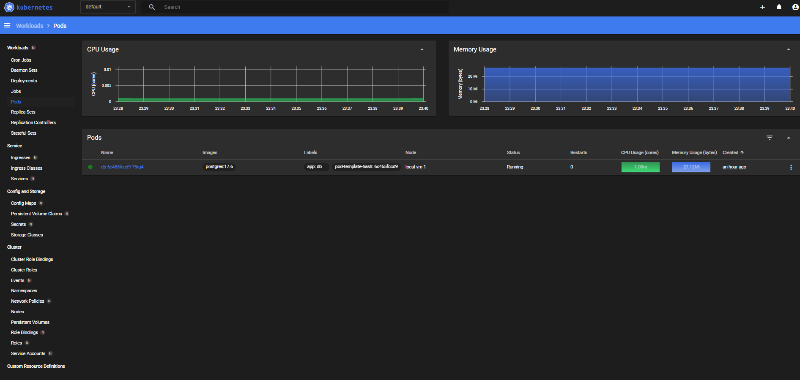
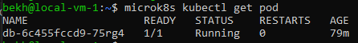
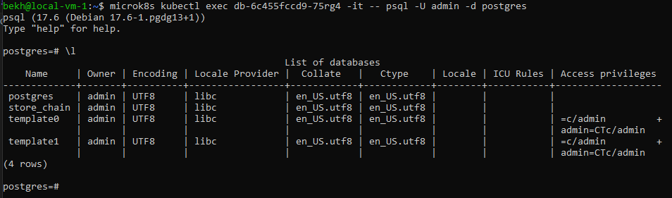
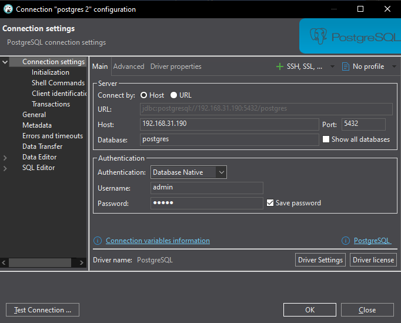
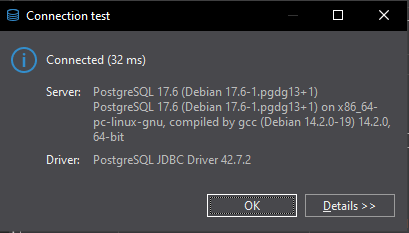

# Установка СУБД PostgreSQL

## Развернуть контейнер с PostgreSQL или установить СУБД на виртуальную машину и запуск сервера.

1. В VirtualBox создаём виртуальную машину.
2. Устонавливаем в неё Ubuntu 24.04.1 LTS. При установки выбирает дополнительно: microk8s и docker.
3. Для создания контейнера создаём 3 файла:
    - [db.yaml](k8s/db.yaml)
    - [db-pv.yaml](k8s/db-pv.yaml)
    - [db-pvc.yaml](k8s/db-pvc.yaml)
4. При помощи команды scp копируем их на ранее созданную виртульную машину.
5. Заходим на неё при помощи ssh.
6. Создаём контейнер:
    - Командой ```sudo usermod -aG microk8s $USER``` добавляем текущего пользователя в группу.
    - Перезагружаем пользователей группы microk8s командой ```newgrp microk8s```
    - Создаём PersistentVolume: ```microk8s kubectl apply -f db-pv.yaml```
    - Создаём PersistentVolumeClaim: ```microk8s kubectl apply -f db-pvc.yaml```
    - Создаём и стартуем под: ```microk8s kubectl apply -f db.yaml```
7. Командой microk8s dashboard-proxy запускаем прокси до дашборда (при выполнении команды сообщается токен для доступа к дашборду, его надо скопировать)
8. Дашборд доступен по адресу ```https://$(адрес_хоста):10443/```

    
    Так же можно проверить командой ```microk8s kubectl get pod```

    

## Создать клиента с подключением к базе данных postgres через командную строку.

### На виртуальной машине подключение к БД:

```microk8s kubectl exec db-6c455fccd9-75rg4 -it -- psql -U admin -d postgres```



## Подключиться к серверу используя pgAdmin или другое аналогичное приложение.

### При помощи dbeaver:



Где 192.168.31.190 IP адрес виртуальной машины.


