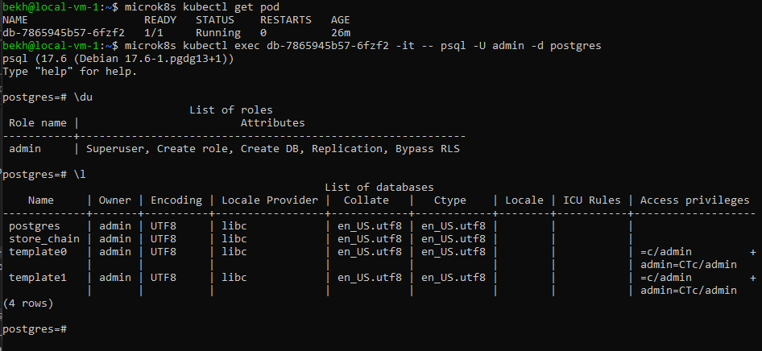

# Реализовать спроектированную схему в postgres.

## Базу данных.

1. Для создания отдельного табличного пространства для индексов создаем дополнительные PersistentVolume и PersistentVolumeClaim:
    - [dbi-pv.yaml](k8s/dbi-pv.yaml)
    - [dbi-pvc.yaml](k8s/dbi-pvc.yaml)
2. Так же добавляем их в манифест пода и при старте выдаём разрешение:
    - [db.yaml](k8s/db.yaml)
3. Применям изменения:
    - Создаём PersistentVolume: ```microk8s kubectl apply -f dbi-pv.yaml```
    - Создаём PersistentVolumeClaim: ```microk8s kubectl apply -f dbi-pvc.yaml```
    - Пересоздаём под: ```microk8s kubectl apply -f db.yaml```

База данных и её владелец у нас создаётся при инициализации пода.




## Табличные пространства и роли.

1. Создание табличного пространства для индексов: ```create tablespace db_indexes location '/mnt/idx';```
2. Создание ролей:
    - Группа с правами только для чтения: ```create role db_reader;```
    - Группа с правами на изменения данных в таблицах (оператор): ```create role db_operator;```
    - Группа с правами на изменения структуры БД (разработчик): ```create role db_developer;```
3. Создадим тестовых пользователей:
    - Пользователь группы только для чтения: 
		```create user r_user WITH ENCRYPTED PASSWORD '123';```
		```grant db_reader to r_user;```
    - Пользователь группы "оператор": 
		```create user o_user WITH ENCRYPTED PASSWORD '123';```
		```grant db_operator to o_user;```
    - Пользователь группы "разработчик": 
		```create user d_user WITH ENCRYPTED PASSWORD '123';```
		```grant db_developer to d_user;```


## Схему данных.

1. Создание схем:
    - Схема для словарей: ```create schema if not exists dic;```
    - Схема для данных: ```create schema if not exists "data";```
2. Определяем роли пользователей для схем:
	- Для группы db_reader:
		 	```GRANT USAGE ON SCHEMA "dic" TO db_reader;```
			```GRANT SELECT ON ALL TABLES IN SCHEMA "dic" TO db_reader;```
			```GRANT USAGE ON SCHEMA "data" TO db_reader;```
			```GRANT SELECT ON ALL TABLES IN SCHEMA "data" TO db_reader;```
	- Для группы db_operator (схема дата изменяется только данными с других касс):
			```GRANT USAGE ON SCHEMA "dic" TO db_operator;```
			```GRANT SELECT ON ALL TABLES IN SCHEMA "dic" TO db_operator;```
			```GRANT INSERT ON ALL TABLES IN SCHEMA "dic" TO db_operator;```
			```GRANT UPDATE ON ALL TABLES IN SCHEMA "dic" TO db_operator;```
			```GRANT DELETE ON ALL TABLES IN SCHEMA "dic" TO db_operator;```
			```GRANT USAGE ON SCHEMA "data" TO db_operator;```
			```GRANT SELECT ON ALL TABLES IN SCHEMA "data" TO db_operator;```
	- Для группы db_developer:
			```GRANT all PRIVILEGES ON ALL TABLES IN SCHEMA "dic" TO db_developer;```
			```GRANT all PRIVILEGES ON ALL TABLES IN SCHEMA "data" TO db_developer;```


## Таблицы своего проекта, распределив их по схемам и табличным пространствам.

[SQL-скрипт создания таблиц, индексов.](sql/store_chain.sql)

## Проверяем:

1. Подключаемся к БД. Устонавлеваем пользователя с правами "только для чтения". Выполняем SELECT таблицы роли и видим что она пустая. Пробуем вставить значение, получаем ошибку.


2. Меняем пользователя на пользователя с ролью оператора. Выполняем SELECT таблицы роли и видим что она пустая. Пробуем вставить значение, получаем сообщение об успехе. Проверяем содержимое таблицы и видим наше значение.


3. Меняем пользователя на пользователя с ролью разработчик. Выполняем SELECT таблицы роли и видим нашу запись. Выполняем команду truncate с параметром cascade, т.к. есть связи с другими таблицами.Проверям что таблица пуста.

